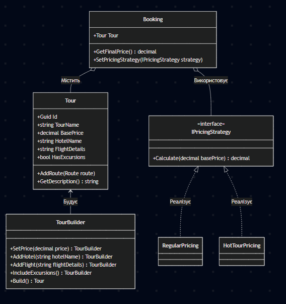

#  Travel Agency (Турагентство) - ООП Проєкт

Навчальний проєкт для демонстрації принципів об'єктно-орієнтованого програмування (ООП), патернів проєктування, роботи з колекціями та тестування на базі платформи .NET 9.0.

##  Архітектура проєкту

Проєкт побудований за принципами **N-Tier (Багаторівневої) архітектури** з чітким розділенням відповідальності (Separation of Concerns):

1. **TravelAgency.Domain (Ядро)** — містить усю бізнес-логіку, сутності (`Tour`, `Client`, `Route`), інтерфейси та патерни. Не має залежностей від інших рівнів.
2. **TravelAgency.App (Консольний інтерфейс)** — точка входу. Відповідає за взаємодію з користувачем, виведення даних у консоль та збереження файлів (JSON).
3. **TravelAgency.Tests (NUnit)** — ізольований проєкт для автоматичного Unit-тестування бізнес-логіки.

###  UML-Діаграма класів 

### Застосовані технології та патерни
Мова та платформа: C#, .NET 9.0

Патерни проєктування (SOLID):

Builder (Будівельник): Гнучке покрокове створення складних об'єктів Tour.

Strategy (Стратегія): Динамічна зміна алгоритмів розрахунку вартості туру (звичайна ціна, гарячий тур).

Колекції та LINQ: Використання List<T>, Dictionary<TKey, TValue> (для оптимізації пошуку), фільтрація та групування даних за допомогою IEnumerable та методів-розширень.

Обробка помилок (Polly): Реалізація Retry Policy з експоненційною затримкою для імітації стабільної роботи при падіннях сервера.

Збереження даних: Серіалізація/Десеріалізація об'єктів у формат JSON (System.Text.Json).

Тестування: Unit-тести за допомогою фреймворку NUnit 4.
